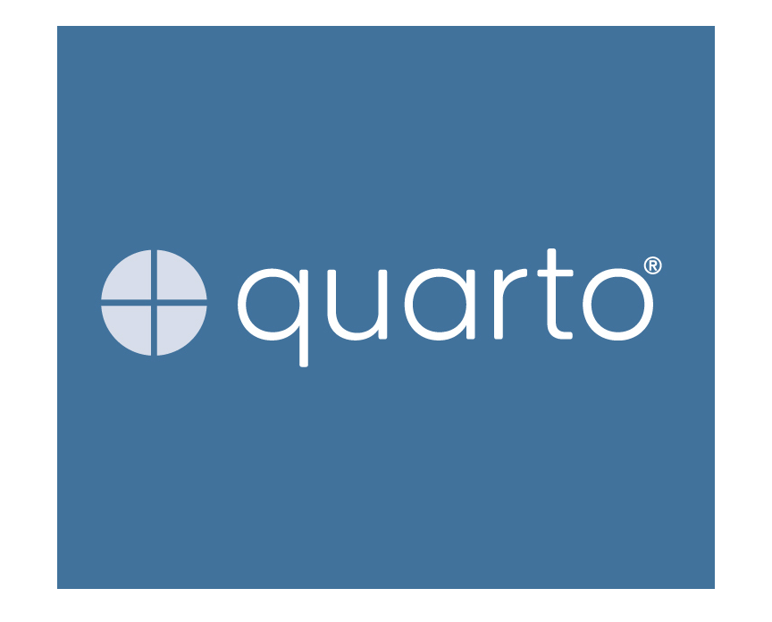

## {background-color="#288DC2"}

:::: {.columns .v-center}

::: {.column width="50%"}
{fig-align="center"}
:::

::: {.column width="50%"}
### Marc Dotson {.permanent-marker-font}

Jon M. Huntsman School of Business  Utah State University

 \@marcdotson

 \@marcdotson.com

 /in/marcdotson
:::

::::

## 

:::: {.columns .v-center}

::: {.column width="50%"}
{fig-align="center"}
:::

::: {.column width="50%" .fragment}
{fig-align="center"}
:::

::::

# {background-image="../figures/positron-01_introduction.png" background-size="contain" footer=false}

## {background-image="../figures/bears_01.png" background-size="contain" footer=false}

## {background-image="../figures/bears_02.png" background-size="contain" footer=false}

## {background-image="../figures/bears_03.png" background-size="contain" footer=false}

## {background-image="../figures/bears_04.png" background-size="contain" footer=false}

## {background-image="../figures/bears_05.png" background-size="contain" footer=false}

## {background-image="../figures/bears_06.png" background-size="contain" footer=false}

## {background-image="../figures/bears_07.png" background-size="contain" footer=false}

## {background-image="../figures/bears_08.png" background-size="contain" footer=false}

## 

:::: {.columns .v-center}

::: {.column width="60%"}
{fig-align="center"}
:::

::: {.column width="40%"}
### Bear No. 1:  Installing Python {.permanent-marker-font .h-center}
:::

::::

## 

{fig-align="center"}

# {background-image="../figures/logo_uv.png" background-size="40%" background-opacity="1"}

# {background-image="../figures/logo_uv.png" background-size="40%" background-opacity="0.2"}

::: {.r-stack}

::: {.r-fit-text .fade-in-then-out .h-center}
Julia Silge's  "How I got unstuck with Python"  posit::conf(2025)
:::

:::

# {background-image="../figures/logo_uv.png" background-size="40%" background-opacity="1"}

# How I Stopped Worrying and Learned to Love the CLI {.h-center}

# {background-image="../figures/positron-02_install-python-via-uv.png" background-size="contain" footer=false}

# {background-image="../figures/positron-03_new-folder-from-template.png" background-size="contain" footer=false}

## 

:::: {.columns .v-center}

::: {.column width="40%"}
{fig-align="center"}
:::

::: {.column width="60%"}
::: {.incremental}
- Prompts install or use `Python: Install Python via uv` command
- Recognizes existing virtual environment or use a project template
- Let's students start with and stay in Positron, which even makes the command line easier
:::
:::

::::

## 

:::: {.columns .v-center}

::: {.column width="50%"}
{fig-align="center"}
:::

::: {.column width="50%"}
### Bear No. 2:  GitHub-Friendly Workflows {.permanent-marker-font .h-center}
:::

::::

# {background-image="../figures/logo_github-jupyter_01.png" background-size="80%" background-opacity="1"}

# {background-image="../figures/logo_github-jupyter_02.png" background-size="80%" background-opacity="1"}

# {background-image="../figures/logo_github-jupyter_02.png" background-size="80%" background-opacity="0.2"}

::: {.r-stack}

::: {.fragment .r-fit-text .fade-in-then-out .h-center}
JSON
:::

::: {.fragment .r-fit-text .fade-in-then-out .h-center}
Oops! All  Notebooks
:::

:::

## 

{fig-align="center"}

# {background-image="../figures/positron-04_quarto-in-line.png" background-size="contain" footer=false}

# {background-image="../figures/positron-05_quarto-typst.png" background-size="contain" footer=false}

## 

:::: {.columns .v-center}

::: {.column width="40%"}
{fig-align="center"}
:::

::: {.column width="60%"}
::: {.incremental}
- Comes pre-installed, is text-based, and renders to various outputs (e.g., Typst)
- Option for in-line output with `quarto.inlineOutput.enabled`
- Quarto 2 promises an automerge-based collaborative editor
:::
:::

::::

## 

:::: {.columns .v-center}

::: {.column width="60%"}
{fig-align="center"}
:::

::: {.column width="40%"}
### Bear No. 3:  Scaling Compute {.permanent-marker-font .h-center}
:::

::::

# Teaching Python *Locally*  with Positron {.h-center}

# {background-image="../figures/remote-ssh.png" background-size="90%" background-opacity="1"}

# {background-image="../figures/remote-ssh.png" background-size="90%" background-opacity="0.2"}

::: {.r-stack}

::: {.r-fit-text .fade-in-then-out .h-center}
Austin Dickey's  "Outgrowing Your Laptop With Positron"  posit::conf(2025)
:::

:::

## 

{fig-align="center"}

# {background-image="../figures/logo_jupyterhub.png" background-size="80%"}

## 

:::: {.columns .v-center}

::: {.column width="40%"}
{fig-align="center"}
:::

::: {.column width="60%"}
::: {.incremental}
- Supports remote SSH for scaling compute with virtual machines
- JupyterHub academic license available for a complete cloud-based option, email [academic-licenses@posit.co](mailto:academic-licenses@posit.co)
:::
:::

::::

## {background-image="../figures/bears_12.png" background-size="contain" footer=false}

