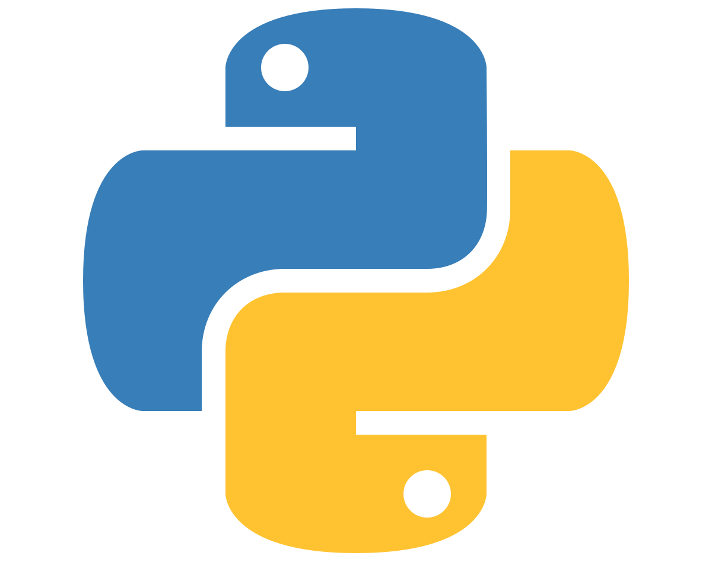
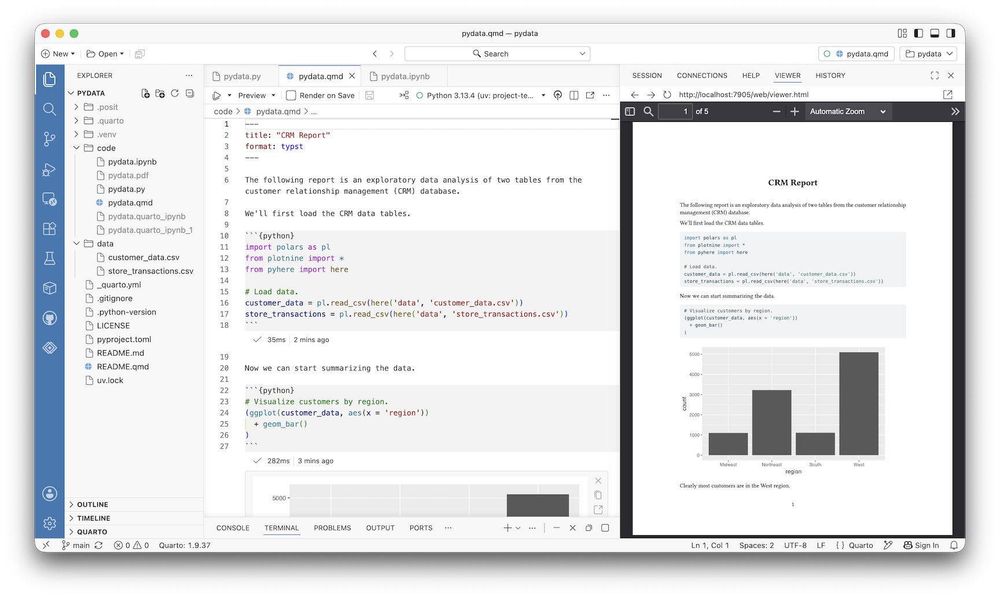

## 

:::: {.columns .v-center}

::: {.column width="50%"}
{fig-align="center"}
:::

::: {.column width="50%" .fragment}
{fig-align="center"}
:::

::::

## {background-image="../figures/bears_01.png" background-size="contain"}

## {background-image="../figures/bears_02.png" background-size="contain"}

## {background-image="../figures/bears_03.png" background-size="contain"}

## {background-image="../figures/bears_04.png" background-size="contain"}

## 

:::: {.columns .v-center}

::: {.column width="50%"}
{fig-align="center"}
:::

::: {.column width="50%"}
### Bear No. 1: Installing Python
:::

::::

## 

:::: {.columns .v-center}

::: {.column width="50%"}
{fig-align="center"}
:::

::: {.column width="50%" .fragment}
{fig-align="center"}
:::

::::

## 

## 

:::: {.columns .v-center}

::: {.column width="50%"}
{fig-align="center"}
:::

::: {.column width="50%"}
### Bear No. 2: GitHub-Friendly Notebooks
:::

::::

## 

:::: {.columns .v-center}

::: {.column width="50%"}
{fig-align="center"}
:::

::: {.column width="50%" .fragment}
{fig-align="center"}
:::

::::

## 

## 

## 

:::: {.columns .v-center}

::: {.column width="50%"}
{fig-align="center"}
:::

::: {.column width="50%"}
### Bear No. 3: Scaling Compute
:::

::::

## {background-image="../figures/bears_08.png" background-size="contain"}

