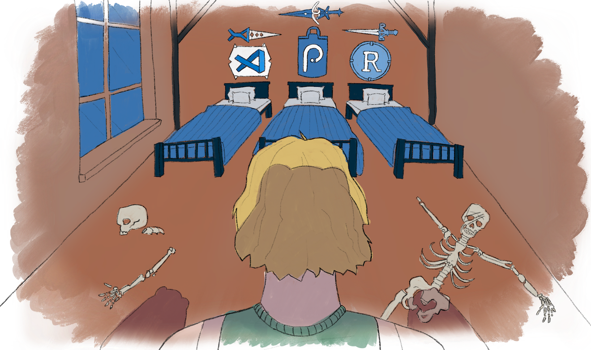
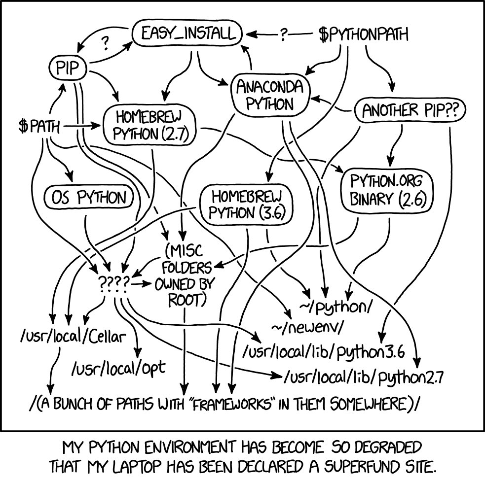
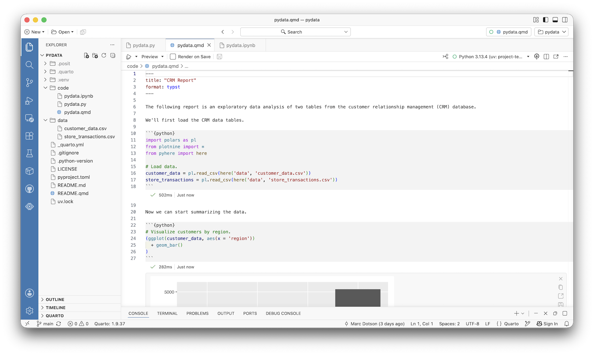

## 

:::: {.columns .v-center}

::: {.column width="50%"}
{fig-align="center"}
:::

::: {.column width="50%" .fragment}
{fig-align="center"}
:::

::::

## {background-image="../figures/bears_01.png" background-size="contain"}

## {background-image="../figures/bears_02.png" background-size="contain"}

## {background-image="../figures/bears_03.png" background-size="contain"}

## {background-image="../figures/bears_04.png" background-size="contain"}

## {background-color="#288DC2"}

:::: {.columns .v-center}

::: {.column width="50%"}
{fig-align="center"}
:::

::: {.column width="50%"}
### Bear No. 1:  Installing Python {.lato-font}
:::

::::

## 

{fig-align="center"}

## 

:::: {.columns .v-center}

::: {.column width="100%"}
{fig-align="center"}
:::

::::

# How I Stopped Worrying and Learned to Love the CLI

## Install Python via uv

## {background-color="#6B9E85"}

:::: {.columns .v-center}

::: {.column width="50%"}
{fig-align="center"}
:::

::: {.column width="50%"}
### Bear No. 2:  GitHub-Friendly Notebooks {.lato-font}
:::

::::

## 

{fig-align="center"}

## Quarto Inline Output

# Quarto 2

## {background-color="#D1CBBD"}

:::: {.columns .v-center}

::: {.column width="50%"}
{fig-align="center"}
:::

::: {.column width="50%"}
### Bear No. 3:  Scaling Compute {.lato-font}
:::

::::

## {background-image="../figures/bears_08.png" background-size="contain"}

